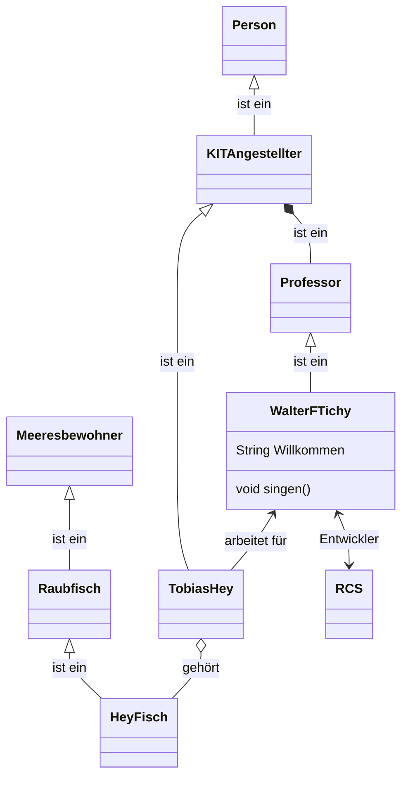
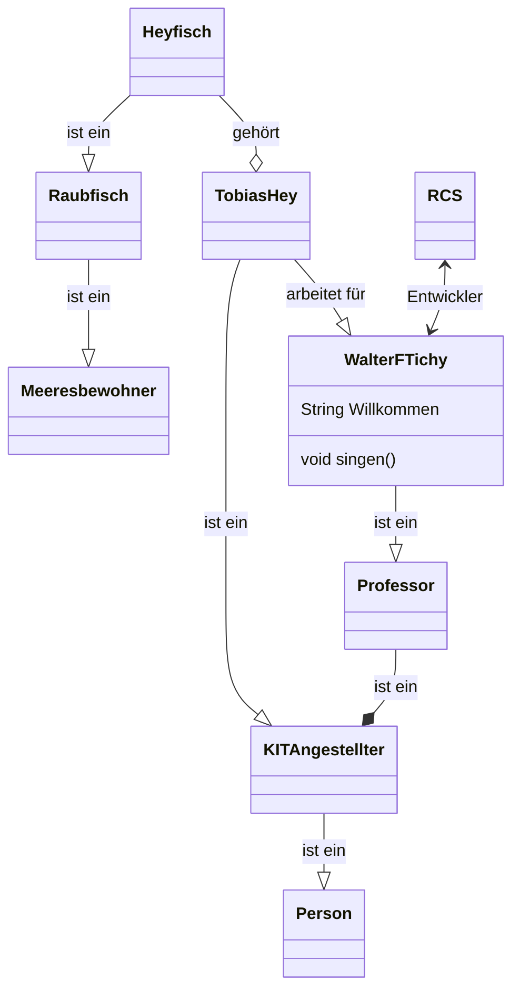

# Repository
Dieses Repository ist Teil eines PSE-Projekt der KIT Universität, Institut KASTEL und unter der GPL3.0-or-later Lizenz veröffentlicht und somit zur Nutzung freigegeben.

# PSE
Dieses Repository beinhaltet den Quellcode zum Pflichtenheft nach dem Wasserfallmodell mit Rückkoppelung.
Zur Compilierung wird eine installierte LaTeX Umgebung mit `latexmk` und `shell-escape` benötigt.

# Kompilierungsmindestanforderungen
Um den Sourcecode zu kompilieren werden diverse Systemvoraussetzungen benötigt. Zum einen natürlich eine lokale LaTeX-Umgebung, die in der Lage ist `latexmk` mit `shell-escape` auszuführen.
Zusätzlich wird zum Rendern der UML-Diagramme `Mermaid-js` benötigt. Die CLI `mmdc` zu `Mermaid-js` kann durch `npm` mit Administratorrechten, sowohl auf Linux als auch auf Windows, durch `npm install -g @mermaid-js/mermaid-cli` installiert werden. 
Zur Installation von `npm` auf Windows kann der [NPM-Installer](https://nodejs.org/en/) verwendet werden.

# Module
Das gesamte Pflichtenheft ist unterteilt in einzelne Kapitel und Unterkapitel bzw. Module und Submodule. Diese können ausgehend von der Hauptdatei `./main.tex` per `\inpmod` eingebunden werden, so bindet `\inpmod{Kriterien}` das Kapitel Kriterien ein. Um in einem Modul ein relatives Submodul einzubinden, kann hierfür `\inprelmod` gleichermaßen verwendet werden.
Um andere, zur momentan bearbeiteten Datei, relative Dateien einzubinden, kann `\relfile` genutzt werden, um zur Compilezeit den richtigen, absoluten Pfad zu bekommen.
Bilddateien im direkten Subordner `images` können über `\inprelimg` eingebunden werden. Bsp: Um `images/bild01.png` mit `10cm` Breite einzubinden, kann `\inprelimg[width=10cm]{bild01.png}` verwendet werden. Die Optionen sind die selben wie für `\includegraphics`.

## Aufbau eines Moduls
Ein Modul besteht mindestes aus einer `main.tex` Datei, welche den Inhalt des Moduls bestimmt. Sollte das Modul aus Submodulen bestehen, so soll die `main.tex` dieses Moduls nur als Einbindungsdatei für die Submodule dienen, um die Struktur dieses Repos einzuhalten.
Andernfalls kann die `main.tex` beliebigen Inhalt beschreiben, jedoch sollte dieser thematisch natürlich zum Modul passen.

# Mermaid-js
[Mermaid-js](https://mermaid-js.github.io/mermaid/#/) ist eine in Java-Script geschriebene Markdown-ähnliche Skriptsprache zur einfachen und graphischen Erstellung von UML-Diagrammen durch einfache textuelle Beschreibungen.
Hierfür existieren mehrere Diagrammarten, Pfeile, Objekte und ähnliches, siehe die [Diagrammarten](https://mermaid-js.github.io/mermaid/#/?id=diagram-types).
Ein Beispiel zu einem einfachen Klassendiagramm, welches zeigt, dass die Richtung der Pfeile visuell einen Unterschied macht:






## Verwendung im LaTeX-Dokument
Zur Verwendung im LaTeX-Dokument existieren die beiden Befehle `\mermaid[options]{source}{dest}` und `\relmermaid[options]{file}`. 
In beiden Befehlen beschreiben die `options` die Optionen, die an `\includegraphics` weitergegeben werden. 
`\mermaid`'s Quell- und Zieldateien sind relativ ausgehend von der Hauptdatei [`Pflichtenheft/main.tex`](./Pflichtenheft/main.tex) und können beliebig gewählt werden, wobei die Quelldatei mit `.mmd` endet, die Zieldatei mit `.png`.
`\relmermaid`'s Parameter ist der Name ohne Endung, die Quelldatei befindet sich im Ordner `./mermaid`, die Zieldatei in `./uml`, ausgehend vom Verzeichnis der inkludierenden Datei. Die Endungen sind analog zu `\mermaid`.

Beispiel der Ordnerstruktur für `\relmermaid[width=10cm]{Klassendiagramm1}` in `./Modelle/main.tex` (Analog ist `\mermaid[width=10cm]{Modelle/mermaid/Klassendiagramm.mmd}{Modelle/uml/Klassendiagramm.png}`, falls `./main.tex` die Hauptdatei ist):
```bash
.
├── main.tex
└── Modelle
    ├── main.tex
    ├── mermaid
    │   └── Klassendiagramm.mmd
    └── uml
        └── Klassendiagramm.png
```

Zu beachten ist bei der Verwendung von `\relmermaid` dass der entsprechende `uml` Ordner existieren muss.