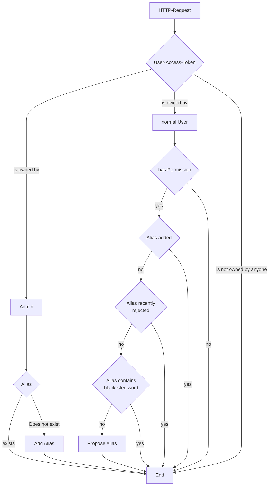

# Ausgangssituation
Der Server hat einen HTTP-Post-Request via der GraphQL-API erhalten.
Dieser Post-Request enthält einen User-Access-Token und einem Alias.

# Ablauf
GraphQL ruft die entsprechend als `@MutationMapping` annotierte Methode `addAlias` auf, die einen String `alias` als Parameter bekommt. \
Diese Methode arbeitet wie folgendermaßen:

1. Gehört der User-Access-Token einem Nutzer, sprich ist der User-Access-Token in der Datenbank vorhanden. Folgende Szenarien sind möglich:

    1. Der User-Access-Token gehört einem Administrator. Dann:

        1. Überprüfe ob der gegebene Alias bereits existiert

            1. Existiert der Alias, so gebe einen Fehler zurück.

            2. Existiert der Alias noch nicht, so füge den Alias hinzu

    2. Der User-Access-Token gehört einem normalen Benutzer (nicht Admin)
    
        Folgende Bedingungen müssen erfüllt sein, damit ein Alias als Vorschlag hinzugefügt wird, andernfalls wird ein Fehler zurückgemeldet (optional)

        1. Der Nutzer hat die Erlaubnis, Aliase vorzuschlagen (optional)
        2. Der Alias wurde noch nicht hinzugefügt
        3. Der Alias wurde nicht kürzlich abgelehnt
        4. Der Alias beinhaltet keine Wörter der Blacklist

    3. Der User-Access-Token gehört keinem Benutzer. \
    Dann gebe einen Fehler zurück.

