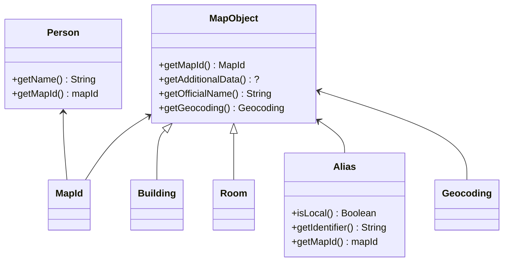

```mermaid
classDiagram
    class MapId {
    }

    class Alias {
        +isLocal() Boolean
        +getIdentifier() String
        +getMapId() mapId
    }

    class Person {
        +getName() String
        +getMapId() mapId
    }

    class MapObject {
        +getMapId() MapId
        +getAdditionalData() ?
        +getOfficialName() String
        +getGeocoding() Geocoding
    }

    class Building {
    }

    class Room {
    }


    MapObject <|-- Building
    MapObject <|-- Room
    Person <-- MapId
    MapObject <-- MapId
    MapObject <-- Alias
    MapObject <-- Geocoding

```