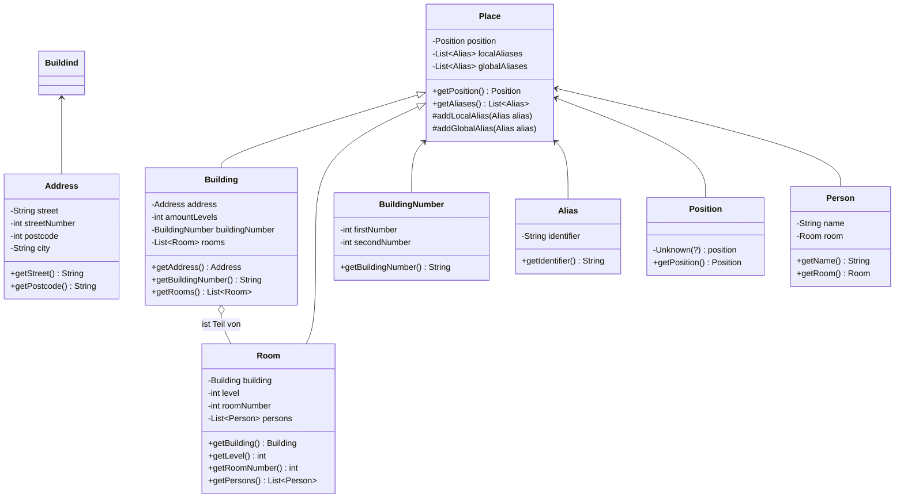

```mermaid
classDiagram
    class Position {
        -Unknown(?) position
        +getPosition() Position
    }

    class Address {
        -String street
        -int streetNumber
        -int postcode
        -String city
        +getStreet() String
        +getPostcode() String
    }

    class Alias {
        -String identifier
        +getIdentifier() String
    }

    class Person {
        -String name
        -Room room
        +getName() String
        +getRoom() Room
    }

    class BuildingNumber {
        -int firstNumber
        -int secondNumber
        +getBuildingNumber() String
    }

    class Place {
        -Position position
        -List~Alias~ localAliases
        -List~Alias~ globalAliases
        +getPosition() Position
        +getAliases() List~Alias~
        #addLocalAlias(Alias alias)
        #addGlobalAlias(Alias alias)
    }

    class Building {
        -Address address
        -int amountLevels
        -BuildingNumber buildingNumber
        -List~Room~ rooms
        +getAddress() Address
        +getBuildingNumber() String
        +getRooms() List~Room~
    }

    class Room {
        -Building building
        -int level
        -int roomNumber
        -List~Person~ persons
        +getBuilding() Building
        +getLevel() int
        +getRoomNumber() int
        +getPersons() List~Person~
    }


    Place <|-- Building
    Place <|-- Room
    Building o-- Room : ist Teil von
    Place <-- BuildingNumber
    Place <-- Alias
    Place <-- Position
    Place <-- Person
    Buildind <-- Address

```