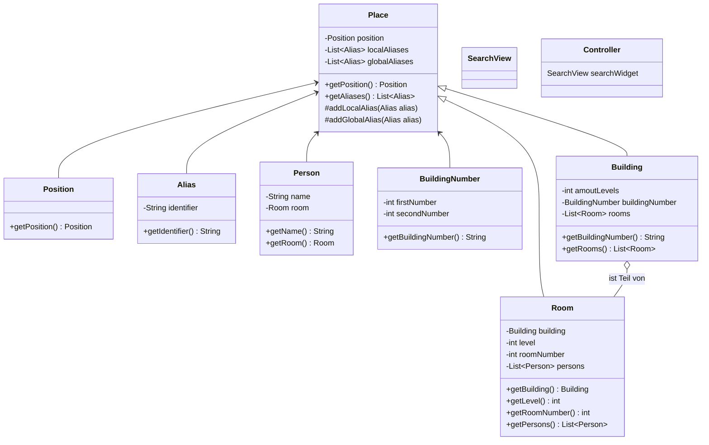

# Ausgangssituation
Der Benutzer befindet sich auf der Hauptansicht (Kartenansicht).  
Der Benutzer möchte nach einem Gebäude oder Raum mittels der Suchfunktion suchen.  
Der Benutzer klickt auf das Suchfeld.

# Ablauf

Das Suchen soll möglich sein mit: 
- Gebäudenummer
- Gebäudenummer und Raumnummer
- Name einer Person (wenn nach deren Büro gesucht wird)
- lokaler Alias
- globaler Alias

Für die Suchfunktion ist eine Suchschnittstelle sinnvoll [(Quelle zum Nachlesen)](#https://developer.android.com/guide/topics/search/search-dialog).  
Diese kann entweder mithilfe von einem `search dialog` oder von einem `search widget` implementiert werden.  
Möglicherweise ist ein `search widget` zielführender, da dieses flexibler und personalisierbarer ist.  
Außerdem wurde das `search widget` ab Android 3.0 eingeführt und ist somit neuer, 'search dialog' gab es nämlich bereits davor.  
Nichtsdestotrotz, folgendes ist zu unterstützen:
1. Die Tastatur ist zu öffnen, unmittelbar nachdem der Benutzer auf das Suchfeld klickt.
    1. Hierfür ist wichtig, dass das Suchfeld ein `TextField` ist, wobei die UI `Compose` sein sollte.
    1. Die letzten Suchbegriffe sind vorzuschlagen.
        1. Hierfür könnte ein `Content` erstellt werden, das `SearchRecentSuggestionsProvider` erweitert (muss dann auch in dem Manifest der App eingetragen werden) [(Quelle zum Nachlesen)](#https://developer.android.com/guide/topics/search/adding-recent-query-suggestions).
        1. Die `searchable configuration` muss den `content provider` berücksichtigen.
        1. Nach jedem ausgeführten Suchen des Benutzers muss die eingegebene Zeichenkette in dem `content provider` gespeichert werden.
1. Der Benutzer kann eine Zeichenkette eintippen.
    1. Während dem Eintippen und sobald der erste Zeichen eingetippt wurde, sind Vorschläge anzuzeigen, die den Benutzer bei der Vervollständigung seiner gewünschten Eingabe unterstützen.
        1. Hierfür ist zum einen die Kommunikation mit der Datenbank auf dem Server wichtig, zum anderen ist eine lokale Datenbank auf dem Smartphone des Benutzers ebenfalls wichtig - die Suchfunktion soll nämlich auch offline möglich sein.
            1. Um mit der Datenbank auf dem Server zu kommunizieren, könnte `GraphQL` benutzt werden, die die zulässigen Gebäudenummer, Gebäudenummer und Raumnummer, Name von Personen (wenn nach deren Büro gesucht wird) und globale als auch lokale Aliasse speichert.
                1. Ein `Content Provider` könnte dann am besten auch implementiert werden, der Zugriff auf die Datenbank mittels `GraphQL` hat (muss dann auch in dem Manifest eingetragen werden) [(Quelle zum Nachlesen)](#https://developer.android.com/guide/topics/search/adding-custom-suggestions).
                1. Die `searchable configuration` muss den `content provider` berücksichtigen.
                1. Der Typ von `Intent`, der gesendet werden soll, wenn der Benutzer einen Vorschlag auswählt, muss deklariert werden.
            1. Um die Datenbank auf dem Smartphone des Benutzers zu erstellen, könnte möglicherweise `Room` verwendet werden [(Quelle zum Nachlesen)](#https://developer.android.com/training/data-storage/room). Um die Daten der lokalen Datenbank insbesondere aber auch aktualisiert zu halten, soll die lokale Datenbank mit der Datenbank auf dem Server kommunizieren können (bzw. die Datenbank auf dem Server abonnieren, um über Aktualisierungen informiert zu sein, Model-View-ViewModel).
        1. Die Namen der Personen, nach deren Büroraum man suchen kann, sind auf dem Server zu speichern.
    1. Hierfür ist wichtig, dass die Architektur Model-View-ViewModel (MVVM) verwendet wird, um Wiederwendbarkeit zu ermöglichen bei gleichzeitigem Aktualisieren der Eingabe des Benutzers (Weitergabe von Benutzerinteraktion, View) und dies behandelt (Logik, Model).
    

